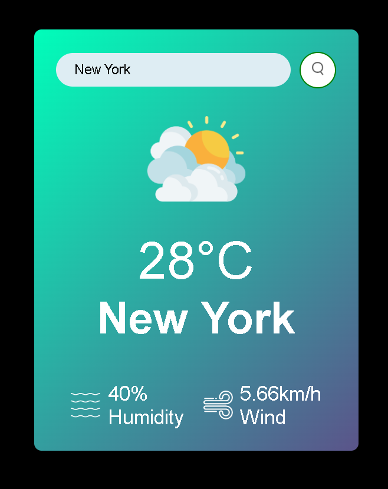

# Weather App



## Description

Weather App is a web application built with React.js , which allows users to check the current weather conditions and forecast for a specific location. The app utilizes the OpenWeather API to fetch real-time weather data and present it in an easy-to-understand format.

## Features
- Search by Location: Users can search for weather information by entering the name of the city.
- Current Weather: The app displays the current weather conditions, including temperature, humidity and wind speed.

- Responsive Design: The application is designed to be responsive and can be used on various devices, including desktops, tablets, and mobile phones.

## Technologies Used
- React.js
- Vite
- OpenWeather API
- Axios

## Installation

Clone the repository:

```bash
git clone https://github.com/Sayakdutt/Weather-App.git
```

Change directory to the project folder:

```bash
cd Weather-App
```
Install dependencies:

```bash
npm install
```

Get an API key from OpenWeather by signing up for a free account.

Create a .env file in the root directory of the project and add your API key:

```bash
VITE_API_KEY=your_openweather_api_key_here
```
Start the development server:

```bash
npm run dev
```
Open your browser and go to http://localhost:5173/ to view the Weather App.

## Usage
 - Enter the name of the city or in the search bar and click on the "Search" button.
- The app will fetch and display the current weather information for the specified location.

